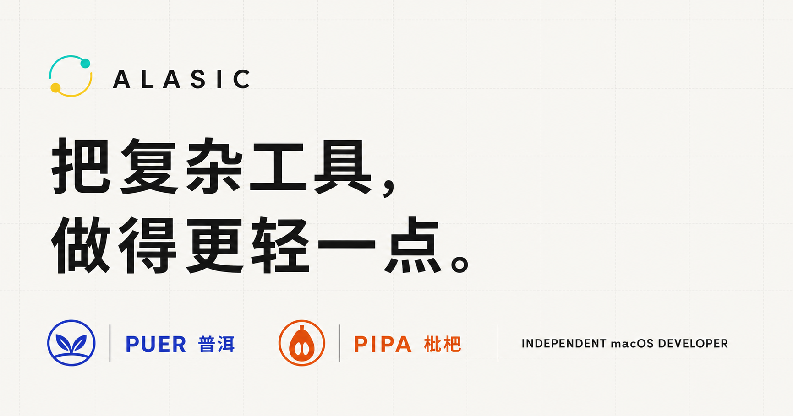

<div align="center">
  

  # Alasic

  **独立开发者的个人网站，也是 Puer 与 Pipa 的产品主页。**

  [访问网站](https://alasicplat.github.io)
  ·
  [查看作品](https://alasicplat.github.io/#work)
  ·
  [GitHub](https://github.com/AlasicPlat)

  [](https://github.com/AlasicPlat/AlasicPlat.github.io/actions/workflows/deploy.yml)
  
</div>



## 关于这个网站

这是一个简洁的单页个人网站，用来介绍我正在打磨的 macOS 软件、记录个人方向，并为每个产品提供截图、版本记录和官方下载入口。

当前展示的作品：

| 产品 | 简介 | 下载 |
| --- | --- | --- |
| [Puer（普洱）](https://github.com/AlasicPlat/puer) | 本地优先的电子表格与结构化数据工作台 | [最新版本](https://github.com/AlasicPlat/puer/releases/latest) |
| [Pipa（枇杷）](https://github.com/AlasicPlat/pipa) | 本地优先的数据库查询工作台 | [最新版本](https://github.com/AlasicPlat/pipa/releases/latest) |

## 技术栈

- [Astro](https://astro.build/)：生成轻量、静态的单页网站。
- TypeScript：集中管理个人信息与产品数据。
- 原生 CSS：负责响应式布局、亮暗模式和视觉细节。
- GitHub Pages：托管生产网站。
- GitHub Actions：在 `main` 更新后自动构建与部署。

## 项目结构

| 路径 | 用途 |
| --- | --- |
| `src/data/site.ts` | 个人介绍、产品文案、功能标签与下载链接 |
| `src/pages/index.astro` | 首页结构、SEO 与社交分享元数据 |
| `src/styles/global.css` | 全局视觉、响应式布局与亮暗模式 |
| `public/images/` | Puer 与 Pipa 产品截图 |
| `public/brand/` | 个人品牌素材 |
| `.github/workflows/deploy.yml` | GitHub Pages 自动部署流程 |

## 本地开发

需要 Node.js 22.12 或更高版本。

```bash
npm ci
npm run dev
```

Astro 会输出本地访问地址。修改内容时，优先编辑 `src/data/site.ts`；替换产品截图时保持 `public/images/` 中的文件名与数据配置一致。

## 构建与预览

```bash
npm run build
npm run preview
```

生产文件会生成到 `dist/`。提交到 `main` 后，[Deploy to GitHub Pages](https://github.com/AlasicPlat/AlasicPlat.github.io/actions/workflows/deploy.yml) 会自动构建并发布到 [alasicplat.github.io](https://alasicplat.github.io)。

## 内容维护

1. 在 `src/data/site.ts` 更新个人介绍、产品文案或下载地址。
2. 在 `public/images/` 替换产品截图。
3. 运行 `npm run build` 检查静态构建。
4. 推送到 `main`，等待 GitHub Pages 部署完成。
